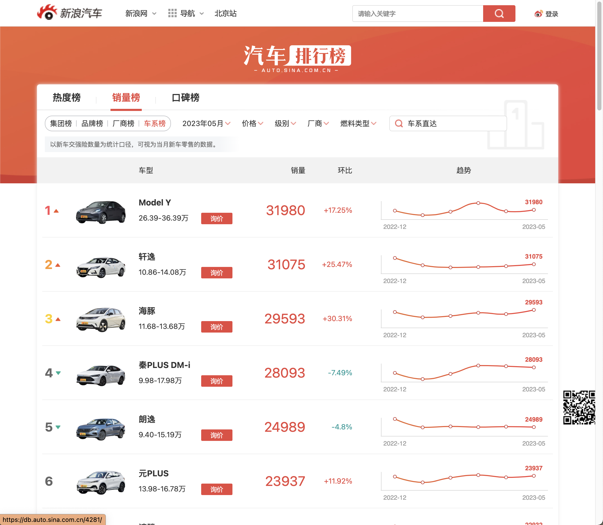
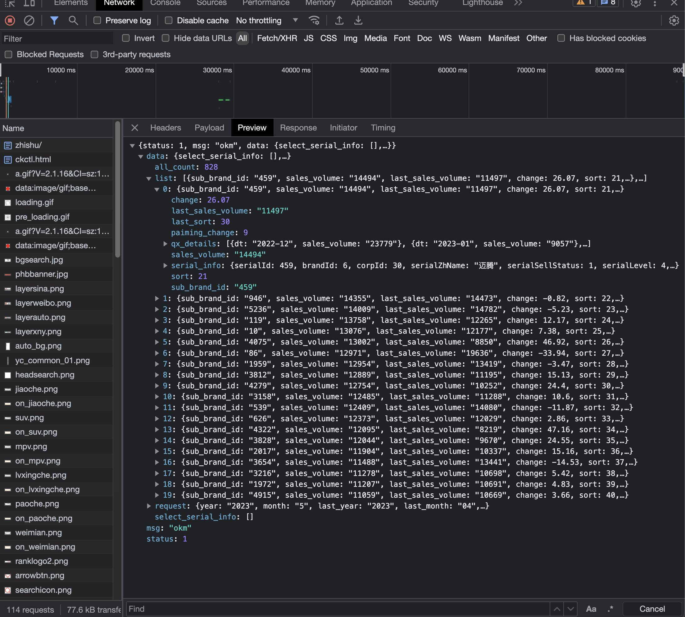
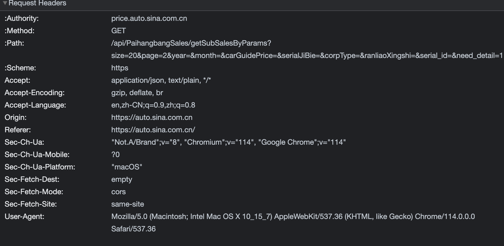

<!-- truncate -->

Bosch实习时，收到一条来自 Mentor 的支线任务————爬取新浪汽车的历史销售数据。

由于公司数据安全，本文纯属居家复现。用以分享爬取思路。

## 开始

众所周知，公司的电脑有严格的软件准入制度，想安装一个软件巨麻烦。所幸系统预装了 Anaonda，打开 Jupyter Lab，就是我熟悉的环境。

接下来是打开浏览器，找到[新浪汽车销量排行榜](https://auto.sina.com.cn/zhishu/#sr_0)。

虽然我惯用的是 Chrome ，但是不得不说，除去Google帐户和扩展商店，Firefox的功能和体验并不输于Chrome。

## 分析

由于自用 Mac 上未装 Firefox，便直接用常用的 Chrome 分析工具示意了。

尝试滚动页面，切换搜索选项，根据路由 `/zhishu/#sr_0` 初步分析，该页面是一个动态页面。

于是果断开始抓包。

撇开 png，gif 等等资源文件，我们很容易就可以发现一系列 json 数据包。

点开细看，不得了，直接就抓到了所需要的包含页面更新所有数据的包。那话不多说，直接分析请求头和 api 接口。

于是我直接用浏览器访问 baseurl/api,直接返回了数据包。

`price.auto.sina.com.cn/api/PaihangbangSales/getSubSalesByParams?size=20&page=2&year=&month=&carGuidePrice=&serialJiBie=&corpType=&ranliaoXingshi=&serial_id=&need_detail=1`

参数直接就是明文？无需coockie？

OK，都不用上什么 scrapy、selenium了，直接 requests 手搓个简单的爬虫就解决问题了。

## 画风突转-1

然而，问题并没有这么简单，当我使用requests库，模拟相同的 hadders 提出 GET 请求时，服务器拒绝了我的连接。

我茫然了。

浏览器可以，python构造的请求却不行，为什么？

于是我使用 curl 尝试，发现直接 curl 网址就可以获取数据包。（这里有一个坑，我在 powershell 中可以，在 cmd 中失败了）

我又在 python os.system中使用curl，也失败了。似乎是 python 发出的请求都不行？如果公司笔记本上有 wireshark ，可能问题就解答了吧。

无论如何，那就先用 powershell 脚本 把数据都扒下来，再用 python json库处理。

## 画风突转-2

开始写批处理，值得注意的是，api有 size 和 page 两个参数，前者默认为20，后者从1开始顺序增长。

不禁思考，如果我将size 设为1000，岂不是直接一个包把整列数据全爬下来？

当然不会有这样的美事，size上限为30，不同page没有重复。于是修改page变量即可。

## 画风突转-3

正常爬取了约5分钟后，powershell开始不断报错，重新尝试，问题依旧。

暂停10分钟后重试，重新恢复连接。

大概是前期大量下载数据触发到反爬程序了吧。

## 最后
折腾了半天，终于把整个流程跑通，复现的Jupyter Notebook 如下。

[下载 auto-sina_sales.ipynb](./crawl_auto_sina_sales/auto-sina_sales.ipynb)