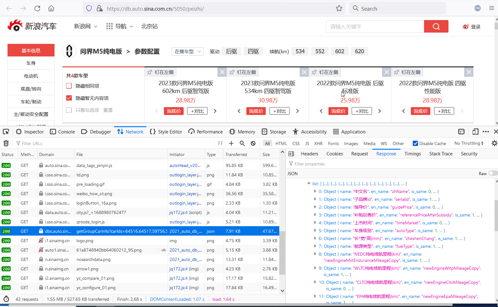
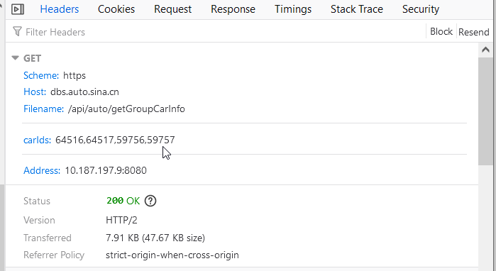

<!-- truncate -->

Bosch实习时，收到一条来自 Mentor 的支线任务————爬取新浪汽车的历史销售数据。

由于公司数据安全，本文纯属居家复现。用以分享爬取思路。

## 开始

众所周知，公司的电脑有严格的软件准入制度，想安装一个软件巨麻烦。所幸系统预装了 Anaonda，打开 Jupyter Lab，就是我熟悉的环境。

接下来是打开浏览器，找到[新浪汽车销量排行榜](https://auto.sina.com.cn/zhishu/#sr_0)。

虽然我惯用的是 Chrome ，但是不得不说，除去Google帐户和扩展商店，Firefox 和 Edge 的功能和体验并不输于Chrome。

## 分析

由于自用 Mac 上未装 Firefox，便直接用常用的 Chrome 分析工具示意了。

尝试滚动页面，切换搜索选项，根据路由 `/zhishu/#sr_0` 初步分析，该页面是一个动态页面。

于是果断开始抓包。

撇开 png，gif 等等资源文件，我们很容易就可以发现一系列 json 数据包。

点开细看，不得了，直接就抓到了所需要的包含页面更新所有数据的包。那话不多说，直接分析请求头和 api 接口。

于是我直接用浏览器访问 baseurl/api,直接返回了数据包。

`price.auto.sina.com.cn/api/PaihangbangSales/getSubSalesByParams?size=20&page=2&year=&month=&carGuidePrice=&serialJiBie=&corpType=&ranliaoXingshi=&serial_id=&need_detail=1`

参数直接就是明文？无需coockie？甚至连伪装 Agent 都不需要？

OK，都不用上什么 scrapy、selenium了，直接用 requests 库就解决问题了。

值得一提的是，在历史数据归档时，我们必须要找到一个可供索引的参数，所幸，我发现了一个参数 `sub_brand_id`,每一个车型都拥有相同的`sub_brand_id`。如特斯拉 ModelY 车型的 sub_brand_id 值就是 4281。

## 画风突转-1

然而，问题并没有这么简单，当我使用requests库，模拟相同的 hadders 提出 GET 请求时，服务器拒绝了我的连接。

我茫然了。

浏览器可以，python构造的请求却不行，为什么？

于是我使用 curl 尝试，发现直接 curl 网址就可以获取数据包。（这里有一个坑，我在 powershell 中可以，在 cmd 中失败了）

我又在 python os.system中使用curl，也失败了。似乎是 python 发出的请求都不行？如果公司笔记本上有 wireshark ，可能问题就解答了吧。

无论如何，那就先用 powershell 脚本 把数据都扒下来，再用 python json库处理。

当然，我们可以在 notebook 里的 code 块里以 `!` 开头执行命令行命令。

Window 下默认终端是 cmd ，于是我们调用powershell执行脚本。 `!powershell -ExecutionPolicy Bypass -File $script`

## 画风突转-2

开始写批处理，值得注意的是，api有 size 和 page 两个参数，前者默认为20，后者从1开始顺序增长。

不禁思考，如果我将size 设为1000，岂不是直接一个包把整列数据全爬下来？

当然不会有这样的美事，size上限为30，不同page没有重复。于是修改page变量即可。

## 画风突转-3

正常爬取了约5分钟后，powershell开始不断报错，重新尝试，问题依旧。

暂停10分钟后重试，重新恢复连接。

大概是前期大量下载数据触发到反爬程序了吧。

## 继续战斗！
本来故事到这里就告一段落了，但是我发现，在 `db.auto.sina.com.cn/<sub_brand_id>/`和`db.auto.sina.com.cn/<sub_brand_id>/peizhi`下，还有更详细的汽车信息。

瞬间，战斗的欲望又燃烧起来了。

这个过程式枯燥而复杂的，我一度想要放弃，考虑把网页整个爬取下来再用 *Beautiful Soup* 之类的 HTML 库解析。

但是在犹豫之际，我坚持了一会.

终于，我找到了想要的数据包和请求。

话不多说，亮一下请求头。

其中，每一个车型的不同档次都对应一个 `carIds`，该参数可以通过 getCarIdBySearch 获取。

只要在 `https://dbs.auto.sina.cn/api/auto/getCarIdBySearch`接口配置参数 serialId 为 sub_brand_id 即可。

以 Tesla 的 ModelY （ sub_brand_id = 4281 ）为例，向服务器发送请求 `https://dbs.auto.sina.cn/api/auto/getCarIdBySearch?serialId=4281`，在收到的 response 里即可找到 `"carIds":["59912","59913","59914"]`

于是，流程闭环，大功告成。

## 最后
复现的Jupyter Notebook 如下。

[下载 sina_sales.ipynb](./crawl_auto_sina_sales/sina_sales.ipynb)

[下载 sina_detail.ipynb](./crawl_auto_sina_sales/sina_detail.ipynb)

最后叠一层甲，本文纯属技术分享，切勿用做非法用途。