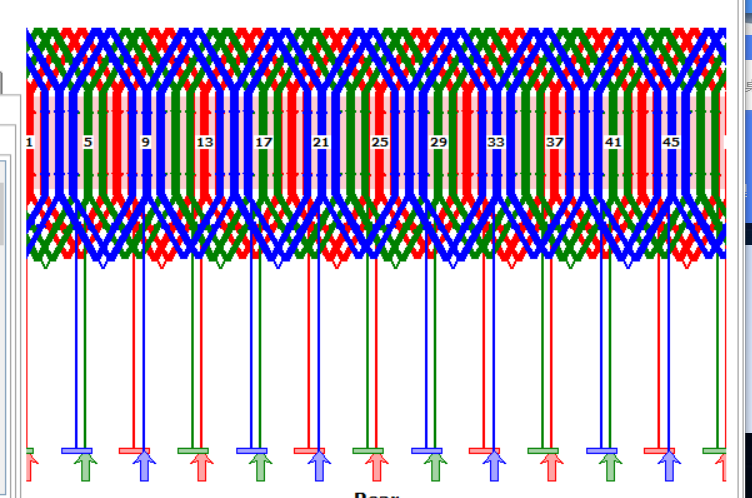
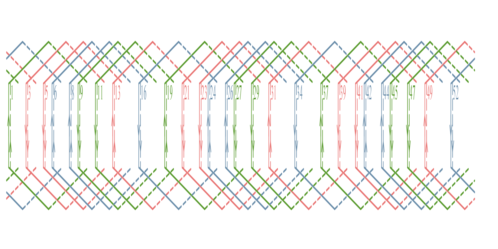
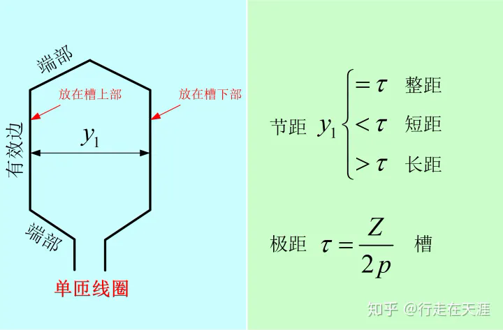
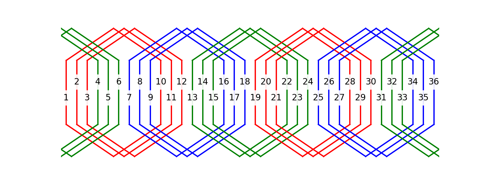
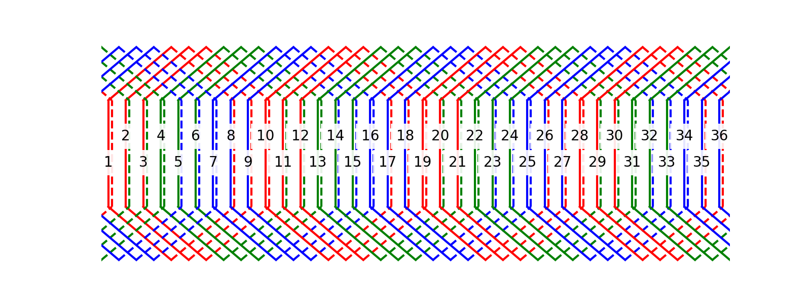
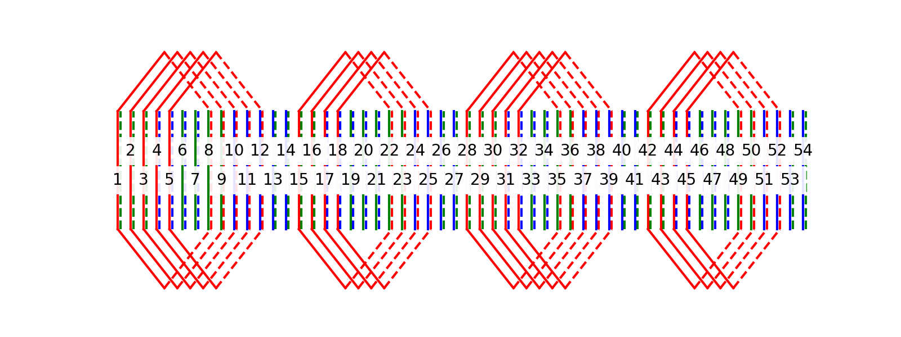

<!-- truncate -->

## 电光火石
今天（5月6号）电机学课上，老师正在讲交流电机绕组。

笔者参与开发的电机设计优化软件中，绕组连接图模块还是沉疴未除。

前几个月里，这一部分的debug工作因为各种原因被搁置。

不知不觉间，创意的火花被点燃，“重构这个模块”的想法出现在我脑海里。

## 前情提要
在商业电机设计软件中，绕组分析模块绕组链接图效果是这样的。



笔者此前的绕组绘制模块主要参考了 [陈嘉豪](https://github.com/horychen) 在 [ACMOP](https://github.com/horychen/ACMOP) 中的绕组分析部分。

ACMOP（Alternating Current Machine Optimization Project），是一个比较完善的电机设计优化项目。在绕组模块，陈主要使用了 python 的 pycairo 库，提供了包括槽电势星型图、绕组链接图等等全流程的绕组分析。

总体评价，陈是笔者暂时无法企及的大佬。但是，针对笔者需求，陈的模块存在一些问题。

1.在笔者的项目中，只需要绘制一张绕组连接图，但是 ACMOP 提供的绕组分析工具太繁复，太“重”。

2.ACMOP 在一些细节上存在问题，如绘制单层绕组（下图）。



3.作为一个有追求的 Coder，笔者觉得 ACMOP 这一部分的代码逻辑走了一些弯路。陷入很多不必要的分类讨论和判断。尤其是画布边缘的端部绕组连接，这一部分在下面介绍笔者的思路时候会详细阐述。

> 由于思路的形成已经在好久之前，笔者懒得一点一点翻 ACMOP 的代码了，读者可以参考陈在b站上的思路讲解，自行体会。[ACMOP-番外1：绕组接线图之Python自动绘制 | 矢量制图库pycairo-哔哩哔哩](https://b23.tv/GsobLk9) Hurry Chen大佬还是很厉害的。

## 漏掉的电机学知识&一些程序技巧

漏掉的电机学知识。。。

那就漏掉吧(bushi)。

这一part主要讲讲在用程序实现绘制绕组链接图中的几个比较重要的想法。


### 初始化和它的自变量s
- Z   定子槽数
- tou 极距
- y1  节距
- n   绕组层数  单层/双层
- a   并联支路数
- N   绕组匝数  单匝/双匝

过程中，笔者计算得出每极每相槽数（Number of slots per pole per phase），记为 spppp。（虽然可能 s4p 会简洁一点，但是笔者喜欢 spppp 这个略带喜感的变量名）

值得注意的是，其中并没有极对数、电角度这些重要电机参数。其实笔者变量的选择是有考量的。
出于模块化和明确接口的想法，绕组绘制模块只接收与绕组绘制直接相关的参数。

```python
class winding(object):
    def __init__(self,Z,tou,y1,n,a,N):
        self.Z,self.tou,self.y1,self.n,self.a,self.drawAllPhase=Z,tou,y1,n,a,drawAllPhase

        self.multiTurn=0
        if N>1:
            self.multiTurn=1    # 多匝绕组

        self.colorMap=["r","g","b",]# A-r B-b C-g
        self.layerBias=0.1  # 两层绕组的偏移=2*self.layerBias
        self.terminalBias=0.1 # 端部引出线的偏移
        
        self.h1=2   # 有效边下侧的y值
        self.h3=8   # 有效边上侧的y值
        self.h2=(self.h1+self.h3)/2   # 序号标签的y值
        self.deltaH=(self.h3-self.h1)/2
        self.h0=self.h1- self.deltaH  # 下侧端部最底值的y值
        self.h4=self.h3+ self.deltaH   # 上侧端部最高值的y值

        self.fig = plt.figure(figsize=(8,3),dpi=200)
```


### 从线圈到线条
众所周知，绕组连接图可以看做若干个单匝线圈（或者多匝线圈）连接而成。

考虑到单匝线圈感应出的电动势明显小于多匝线圈，且实际应用中多匝线圈的电机使用更多，~~为了省事~~，笔者在程序中虽然考虑了线圈匝数但是，基本上按照多匝线圈的画法去绘制。




```python
def drawVerticalLine(self,x,phase,layer):
        """
        画绕组连接图有效部分:画一条垂直线
        """
        color=self.colorMap[phase]
        linestyle=[‘-‘,‘--‘][layer] # 第一层为实线，第二层为虚线
        plt.plot([x,x],[self.h1,self.h3],color=color,linestyle=linestyle)
    
    def drawFoldingLineUpper(self,x1,x2,phase,layer):
        """
        画绕组端部（上方）
        """
        color=self.colorMap[phase]
        xmid=(x1+x2)/2
        linestyle=‘-‘
        plt.plot([x1,xmid],[self.h3,self.h4],color=color,linestyle=linestyle)   # 左侧边
        linestyle=[‘-‘,‘--‘][layer] # 第一层为实线，第二层为虚线
        plt.plot([xmid,x2],[self.h4,self.h3],color=color,linestyle=linestyle)   # 右侧边
        
    def drawFoldingLineLower(self,x1,x2,phase,layer):
        """
        画绕组端部（下方）
        """
        color=self.colorMap[phase]
        xmid=(x1+x2)/2
        linestyle=‘-‘
        plt.plot([x1,xmid],[self.h1,self.h0],color=color,linestyle=linestyle)   # 左侧边
        linestyle=[‘-‘,‘--‘][layer] # 第一层为实线，第二层为虚线
        plt.plot([xmid,x2],[self.h0,self.h1],color=color,linestyle=linestyle)   # 右侧边
```
一些纯粹的工具函数，一个函数只干一件事与可复用性结合。

### 循环，计数，绘图
```python
def draw(self):
        spppp=self.tou/3    #每极每相槽数 Number of slots per pole per phase
        phase=0

        for i in range(0,self.Z):
            
            if self.n == 1:
                if not int(i/spppp)%2:  # 判断是否已经画过
                    phase=int(i/spppp)%3    # 计算
                    hText1=self.h2-self.deltaH/4+i%2*self.deltaH/2
                    hText2=self.h2+self.deltaH/4-i%2*self.deltaH/2
                    
                    x1=i
                    self.drawVerticalLine(x=x1,phase=phase,layer=0)
                    
                    plt.text(x1,hText1,f"{int(x1+1)}",horizontalalignment = ‘center‘, bbox=dict(fc=‘white‘,lw=0,alpha=0.9))

                    x2=i+self.tou
                    self.drawVerticalLine(x=x2,phase=phase,layer=0)
                    text=plt.text(x2,hText2,f"{int(x2+1)}",horizontalalignment = ‘center‘, bbox=dict(fc=‘white‘,lw=0,alpha=0.9))

                    if self.drawAllPhase or self.drawAllPhase+phase==0:
                        self.drawFoldingLineUpper(x1,x2,phase,layer=0)
                        self.drawFoldingLineLower(x1,x2,phase,layer=0)

                    if x2>=self.Z:
                        x1-=self.Z
                        x2-=self.Z
                        text.remove()
                        
                        self.drawVerticalLine(x=x1,phase=phase,layer=0)
                        self.drawVerticalLine(x=x2,phase=phase,layer=0)
                        plt.text(x2,hText2,f"{int(x2+1)}",horizontalalignment = ‘center‘, bbox=dict(fc=‘white‘,lw=0,alpha=0.9))
                
                        if self.drawAllPhase or self.drawAllPhase+phase==0:
                            self.drawFoldingLineUpper(x1,x2,phase,layer=0)
                            self.drawFoldingLineLower(x1,x2,phase,layer=0)
                
            elif self.n == 2:
                phase=int(i/spppp)%3    # 计算
                hText=self.h2-self.deltaH/4+i%2*self.deltaH/2
                x1=i-self.layerBias
                self.drawVerticalLine(x=x1,phase=phase,layer=0)
                plt.text(x1,hText,f"{int(i+1)}",horizontalalignment = ‘center‘, bbox=dict(fc=‘white‘,lw=0,alpha=0.9))

                x2=i+self.y1+self.layerBias
                self.drawVerticalLine(x=x2,phase=phase,layer=1)

                if self.drawAllPhase or self.drawAllPhase+phase==0:
                    self.drawFoldingLineUpper(x1,x2,phase,layer=1)
                    self.drawFoldingLineLower(x1,x2,phase,layer=1)
                if x2>=self.Z:
                    x1-=self.Z
                    x2-=self.Z
                    
                    self.drawVerticalLine(x=x2,phase=phase,layer=1)
                    if self.drawAllPhase or self.drawAllPhase+phase==0:
                        self.drawFoldingLineUpper(x1,x2,phase,layer=1)
                        self.drawFoldingLineLower(x1,x2,phase,layer=1)
            else:
                print("不支持更多绕组层数")
                break
        
        plt.axis (‘off‘) 
        plt.xlim(-0.5,self.Z-0.5)
        plt.show()
        plt.savefig(‘./draw_winding_diagram/WindingDiagram.png‘,bbox_inches=‘tight‘)
```
1.实际中，绕组是循环绕制在圆柱形的电机中。于是就像一个行列式，当绕组线圈向右超出画布，自动在画布左侧延伸出来。

这一个朴素的想法就免去了很多分类讨论。

2.通过`plt.axis (‘off‘) `和`plt.xlim(-0.5,self.Z-0.5)`隐藏坐标系并将0-Z的区域显示出来。即可成功在画布上保留所需的部分。

3.注意一下前文的 self.colorMap，我没有用一个字典，而是一个数组，也是别有用心。

在python中，通过元素序号和index方法，列表可以实现键和值的双向索引，在很多时候是一个很好用的数据结构。

搭配上循环中的计数器的取整、取余、取模运算，可以省略很多循环语句。如这里的`if not int(i/spppp)%2`和`phase=int(i/spppp)%3`

其实字典也是一个我比较喜欢的数据结构，其中的奇技淫巧以后遇到再说。

```python
if __name__=="__main__":
    Z=54
    p=4
    tou=Z/p
    y1=7
    n=1
    a=1
    N=2
    drawAllPhase=0
    if 0:
        w=winding(Z,tou,y1,n,a,N,drawAllPhase)
    else:
        n=2
        w=winding(Z,tou,y1,n,a,N,drawAllPhase)
    w.draw()
```

1.这里的`if 1`和`else`可以快速选择单层绕组和多层绕组参数，进行测试。


2.`if __name__=="__main__":`也值得一提。除了这里的常规用法，在import阶段也大有可为。

大型项目中文件可能并不在项目工作路径下，直接执行文件造成一些路径错误。`if __name__ ...`中完全可以独立制造出一些测试案例。

搭配doctest等测试工具可能更棒。

### 闪亮登场

36槽4极单层绕组



36槽4极整距双层绕组



36槽4极短距（节距为7）双层绕组（只绘制A相）



---
线圈间连接和串并联支路等内容

### 未完待续

